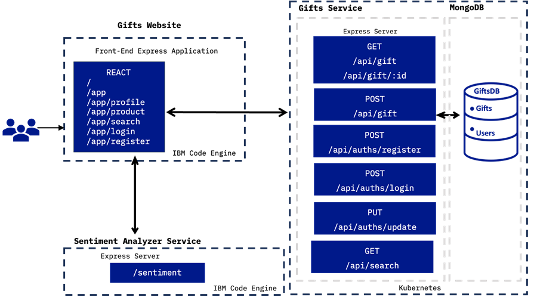
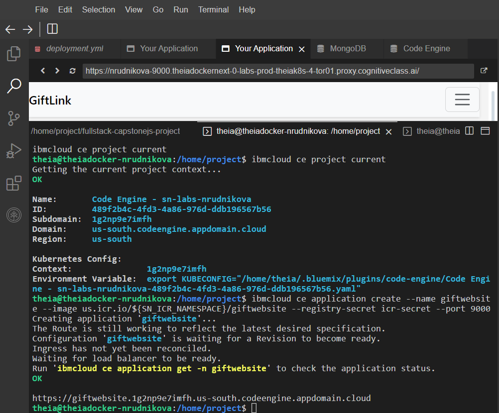

  

<h1 align="center">GiftLink Full-Stack Javascript Application</h>

  
  

# Overview

In the course's final week, the skills will be applied to complete a GiftLink Full-Stack Javascript Application, which has been done according to established architecture and requirements. This project marked the conclusion of IBM Full-Stack JavaScript Developer Professional Certificate, representing the pinnacle of the Full-Stack JavaScript Developer Development Track.

### Work Structure
1.	Finish user stories
2.	Initialize and populate MongoDB
3.	Run skeleton application
4.	Implement a landing page and navigation
5.	Add authentication components and logic
6.	Implement Gifts details page
7.	Implement a search component
8.	Design and implement the comments feature
9.	Containerize the services and applications
10.	Deploy backend and frontend

## User Stories
User stories are a fundamental component in Agile methodologies, serving as a simple yet powerful tool for understanding user requirements. They are typically written from a user's perspective and focus on what they need from the system to achieve a specific goal. A well-crafted user story is concise and focuses on a single functionality or feature, helping to break down complex projects into manageable work units.

Create ten user stories in your GitHub repository, one for each of the above steps of your project.

## Assignment Breakdown

# Assignment 1
In the first assignment, you will use your GitHub account to clone the skeleton code, which will get you started with various functions and supply you with some of the code for the backend services. You will write a series of user stories to create a Kanban board to track your progress throughout the project. You will also set up a Mongo database that your application will utilize for data storage.

# Assignment 2
In the second assignment, you will define API endpoints for listing resources and implement two backend services: one that allows searches with multiple parameters and another for sentiment analysis to analyze user comments.

# Assignment 3
In the third assignment, you will develop the front-end components using HTML, CSS, and the React web framework. These components include the details page, the home page and navigation, the login and registration pages, the landing page, and the search page. In most cases, you will be given some skeleton code to work with and directed to complete different tasks to make the functions provide the desired behavior.

# Assignment 4
In the fourth assignment, you will write APIs and implement them into the backend services related to authentication: registration, login, and the user profile functionality described earlier. You will use JSON Web Tokens as a secure means to represent the user's credentials and data.

# Assignment 5
The fifth assignment is the last development assignment. You will containerize the application for deployment. You will use the Docker platform and apply DevOps practices, such as GitHub actions and CI/CD, to deploy your app to multiple cloud platforms, including a Kubernetes cluster and IBM code engine.

# Assignment 6
In this last assignment for the course, you will submit your project for peer review. Your peers will evaluate your project based on the criteria in a rubric and assign points accordingly. The assignment also contains several readings for wrapping up the course:

  

